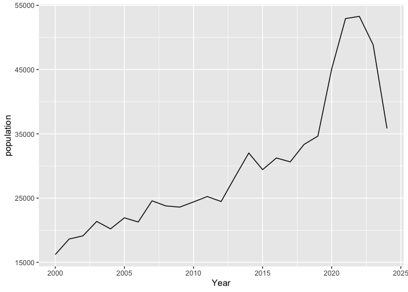

<!-- README.md is generated from README.Rmd. Please edit that file -->

# grasslandbirds

<!-- badges: start -->
<!-- badges: end -->

The goal of grasslandbirds is to provide an analysis and a comparison of
the population of grassland birds in North America, with the production
rate of various livestock and crops. The population data is based on
various grassland bird species that were recorded within the Project
Feederwatch survey (2000 - 2024). The production rate, is taken from the
Food and Agriculture Organisation of the United Nations (FAO), the data
shows the amount of livestock and crops that were produced (in tonnes)
in North America.

## Installation

You can install the development version of grasslandbirds from
[GitHub](https://github.com/) with:

``` r
remotes::install_github("ETC5523-2024/assignment-4-packages-and-shiny-apps-rwer0002")
```

## Example

This is a basic example which shows you how to plot the grassland bird
population:

``` r
library(grasslandbirds)
#> Loading required package: tidyverse
#> ── Attaching core tidyverse packages ──────────────────────── tidyverse 2.0.0 ──
#> ✔ dplyr     1.1.4     ✔ readr     2.1.5
#> ✔ forcats   1.0.0     ✔ stringr   1.5.1
#> ✔ ggplot2   3.5.1     ✔ tibble    3.2.1
#> ✔ lubridate 1.9.3     ✔ tidyr     1.3.1
#> ✔ purrr     1.0.2     
#> ── Conflicts ────────────────────────────────────────── tidyverse_conflicts() ──
#> ✖ dplyr::filter() masks stats::filter()
#> ✖ dplyr::lag()    masks stats::lag()
#> ℹ Use the conflicted package (<http://conflicted.r-lib.org/>) to force all conflicts to become errors
library(tidyverse)

analysis_data %>%
  ggplot(aes(x = Year, y = population)) +
  geom_line()
```



Moreover, an interactive online app for this data can be deployed by
using the **launch_app** function, within the package.
